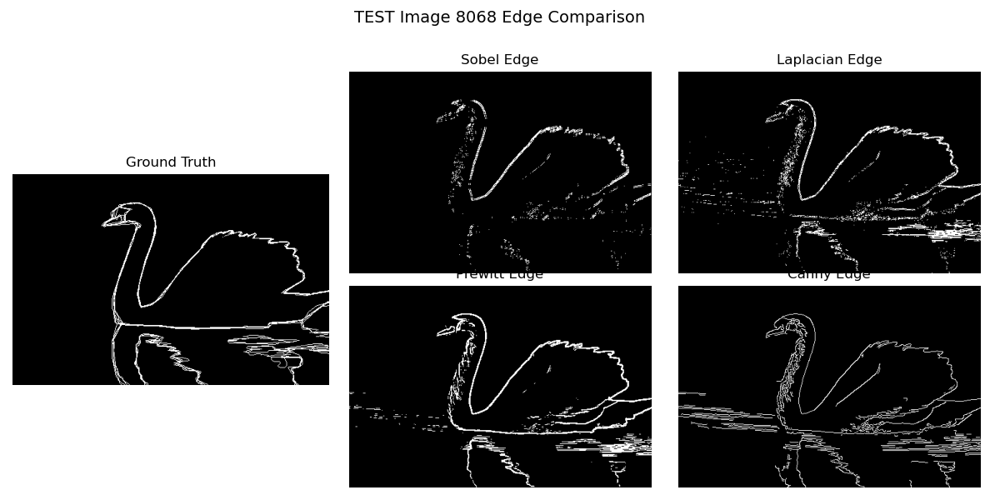
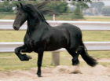
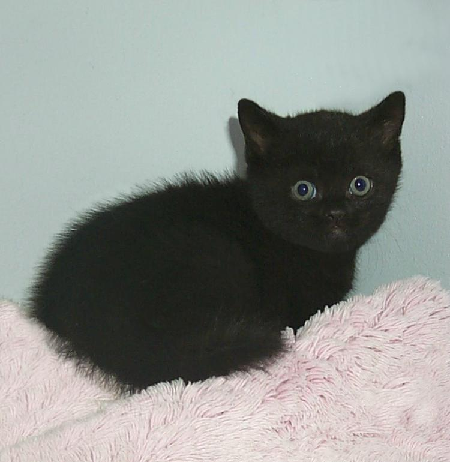
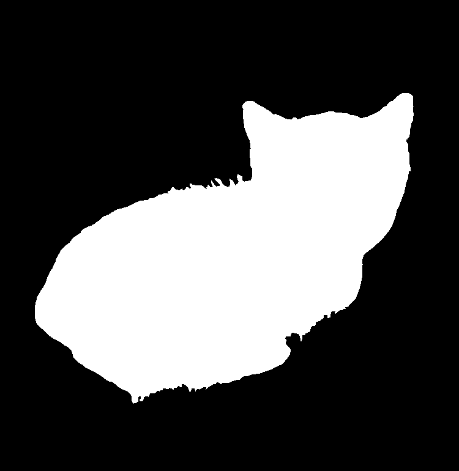
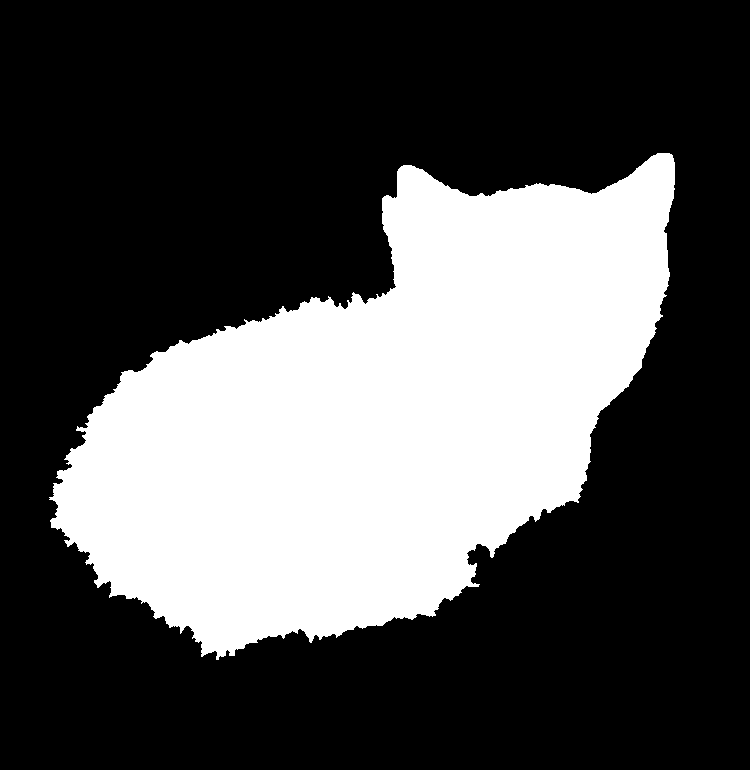

# 📌 图像处理综合实验：边缘检测 × 图像金字塔重建 × 图像分割

本项目分三个阶段实现图像边缘检测、金字塔重建与图像分割任务，无缝连接课程矩阵知识与实际效果对比。

---

## 🧬 实验目标

- 理解边缘检测的基本原理与应用场景
- 掌握图像金字塔（Gaussian / Laplacian）构建与重建方法
- 实现简单的图像增强或分割
- 比较不同边缘检测算法的效果
- 结合多个处理模块完成复合型任务

---

## 🚀 环境配置

```bash
conda create -n cv-edge python=3.8
conda activate cv-edge
pip install numpy opencv-python matplotlib scikit-image scipy scikit-learn
```

需要包括：
- numpy / opencv-python / matplotlib
- scikit-image / scipy / scikit-learn

---

## 🔧 项目结构

```
cv-edge/
├── edge_detection.py        # 阶段一：多算法边缘检测与评估
├── pyramid.py               # 阶段二：图像金字塔构建与重建
├── segmentation.py          # 阶段三：边缘引导的图像分割与评估
├── dataset/                 # 数据集目录
│   ├── BSDS500/             # 包含 images 和 ground_truth
│   ├── Kodak/               # Kodak 图像用于金字塔实验
│   ├── horses/              # 马图分割数据集
│   └── hw2data/             # 小猫图分割数据集
├── results/                 # 所有输出图像与评估结果
│   ├── edges/               # 边缘检测图像
│   ├── segmentation/        # 分割图像与日志
│   └── kodak_pyramid/       # 金字塔重建图与 PSNR 记录
└── README.md
```

---

## 📆 数据集

| 数据集名称                        | 应用场景                           | 下载地址 |
|----------------------------------|------------------------------------|----------|
| **BSDS500**                      | 边缘检测、分割评估                 | [link](https://www2.eecs.berkeley.edu/Research/Projects/CS/vision/grouping/resources.html) |
| **Kodak Lossless True Color**    | 金子塑构建与图像重建               | [link](https://r0k.us/graphics/kodak/) |
| **Weizmann Horse Dataset**       | 基于边缘的形体描述与图像分割       | [link](https://github.com/rooshenas/horses_dataset/) |
| **hw2data 小猫数据集**           | 图像分割任务评估                   | 课程提供 |

---

## 🚀 运行说明

### 1️⃣ 阶段一：边缘检测与效果对比

#### ✅ 运行命令
```bash
python edge_detection.py
```

#### ✅ 任务说明
- 使用 Sobel、Prewitt、Laplacian、Canny 四种算法对 BSDS500 图像进行边缘检测
- 每张图像输出算法边缘结果并与 Ground Truth 对比
- 自动评估 Precision、Recall、F1、IoU 并汇总统计

#### ✅ 示例结果
- **任务类型：边缘检测效果对比（Sobel/Prewitt/Laplacian/Canny）**  
  - 原图：
  - 边缘检测结果：
<!-- | 原图 | 边缘检测结果 |
|------|----------------|
||| -->

### 2️⃣ 阶段二：图像金字塔构建与图像重建

#### ✅ 运行命令
```bash
python pyramid.py
```

#### ✅ 任务说明
- 构建图像的高斯金字塔与拉普拉斯金字塔
- 在不同层数下重建图像并评估重建质量（PSNR、SSIM、MSE）

#### ✅ 示例结果
- **任务类型：Laplacian 金字塔图像重建效果（3 层 / 4 层 / 5 层）**  
  - 原图：
  - 三层金字塔重建：
  - 四层金字塔重建：
  - 五层金字塔重建：
<!-- | 原图 | 三层金字塔重建 |
|------|----------------|
|  |  |
| 四层金字塔重建 | 五层金字塔重建 |
|  |  | -->


### 3️⃣ 阶段三：边缘引导的分割任务

#### ✅ 运行命令
```bash
python segmentation.py
```

#### ✅ 任务说明
- 使用边缘检测 + 形态学处理 + 分水岭算法完成图像分割
- 支持 Weizmann Horse 和小猫数据集
- 输出预测掩码并评估 IoU / F1

#### ✅ 示例结果
- **任务类型：马图结构分割（基于 Canny）**  
  - 原图：
  - 标注：
  - Canny：
  - Laplacian：
  - Prewitt：
  - Sobel：
<!-- | 原图 | Canny | Prewitt |
|------|-------|---------|
|  |  |  |
| 标注 | Laplacian | Sobel |
|  |  |  | -->


- **任务类型：猫图结构分割（基于 Canny）**  
  - 原图：
  - 标注：
  - Canny：
  - Laplacian：
  - Prewitt：
  - Sobel：
<!-- | 原图 | Canny | Prewitt |
|------|-------|---------|
|  |  |  |
| 标注 | Laplacian | Sobel |
|  |  |  | -->


---

## 📌 总结

- 本项目展示了图像边缘检测、金字塔重建与分割相结合的实际效果
- 支持多算法对比和指标评估，结构清晰
- 适合课程实验、规范评估与自学经验


